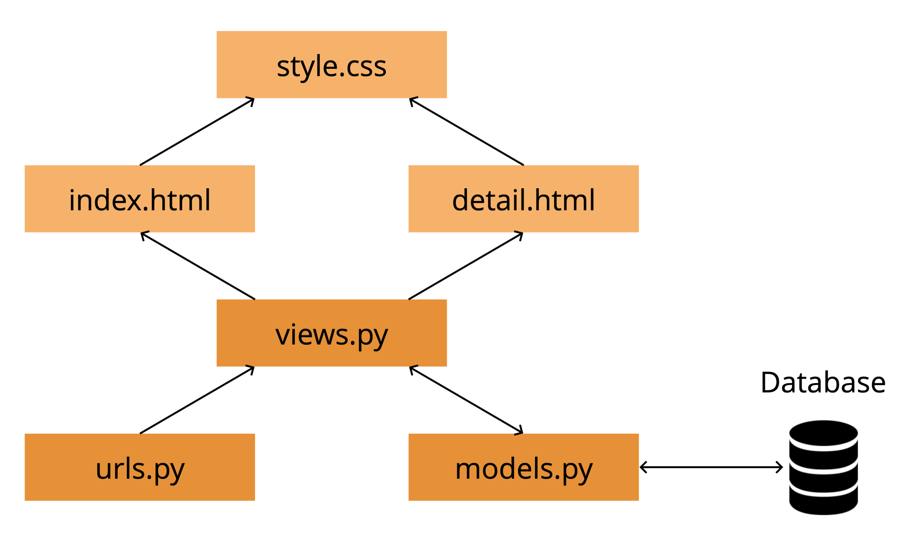

# Web development with Django :rocket:

Welcome to our web development course in Django! This course will give you an introduction to Django and its core concepts, in addition to how HTML and CSS can be used to form a simple web page.

## How to start the application

To simply the process of setting up the project, we will use an online code editor called repl.it. Repl.it is perfect for short courses like this, as you can just import the code to this online editor instead of setting everything up on your personal laptops.

1. Head over to [repl.it](https://repl.it) and create your own account.
2. Click on the button `New repl`, and choose the tab `Import from GitHub`. Import this repository by copying and pasting the following link: https://github.com/Itera/ada-django-kurs. The import view looks like this:

3. Wait for repl.it to complete the import. If you receive an error saying that "The IDE is having a bit of trouble", click the `Reload` button as suggested by repl.it. The import is finished once you see the file tree and code editor, as shown in the screenshot below.

Our project is now imported, and it is almost time to get started! 

Press the `Run` button on the top of your repl.it page. repl.it will now install all the packages that are required to run your application. Once a window with the title "My recipe list" opens, the application has started successfully :tada:

The application preview on the right is quite small, so we recommend you to open the application in a new tab. To do this, click on the squared button with an arrow inside it. Your application will now open in a new tab in your browser.

Before starting on the tasks in the `__tasks__` folder, read the project introduction below to get an overview of how the application and the database are structured.

## Project overview

### How is our application structured?

The project we are going to be working with today is a collection of recipes. To provide you some recipes in the application, we have created a database in advance. Please note that the recipes are just examples, so exploration of these are at your own risk :smile:

#### List view

Open the url https://ada-django-kurs.[REPLIT_USERNAME].repl.co/cookbook/. This is our **list view**, where all our recipes will be displayed. For now we have "hardcoded" a recipe to show you some content, but one of your first tasks will be to retrieve and display the recipes here.

#### Detail view

Open the url https://ada-django-kurs.[REPLIT_USERNAME].repl.co/cookbook/1. This is our **detail view**, where the specifics of a single recipe will be displayed. The _1_ in the url indicates that we are looking at the recipe with _id = 1_. To show you some content, we have hardcoded a recipe here also. Displaying a recipe and its details will be one of your later tasks.

#### Admin view

Open the url https://ada-django-kurs.[REPLIT_USERNAME].repl.co/admin and log in with the username _ada_ and password _lovelace_. Now you are in the **admin view** of our application. Click on the link `Recipes`, and you will see a list of all the recipes we have registered in the database. These are the recipes you are going to retrieve and display in our application. If you are curious, you can also click on each recipe and view and edit its specifics.

### How does Django work?

For this project, the following files are relevant to take a look at:

- `cookbook/templates/cookbook/index.html`
- `cookbook/templates/cookbook/detail.html`
- `cookbook/static/cookbook/style.css`
- `cookbook/views.py`
- `cookbook/urls.py`
- `cookbook/models.py`

`urls.py` defines which pages we can access through our application, for instance _/cookbook_ and _/cookbook/1_, and associates these with _views_. The views are defined in `views.py`, and decides what content or which templates to render for the different views.

`index.html` and `detail.html` are templates written in HTML. The templates define what type of content the web page should contain, and the content is styled using the CSS in `style.css`. These three files construct the "visual" part of our web application.

For a description of `models.py`, take a look at the section below.

### How is our data structured?

The database models are defined in `models.py`. The file specifies what kind of objects we would like to store, in addition to which attributes (_fields_) are associated with them. For instance, our recipe model has the following fields:

- title
- description
- ingredients
- image
- pub_date (date published)

The first three fields are of type `TextField`, and store textual input. Image is of type `ImageField`, and stores an image, as you might have guessed. Pub-date is of type `DatetimeField`, and stores a value for a specific point in time. We have configured that the default value for this field is the current timestamp, if the field value is not specified by the user.

### Tasks and solutions

Now it's time to get started on the tasks! The `__tasks__` folder is structured like this:

- `part1`: tasks for part 1 of the course.
- `part2`: tasks for part 2 of the course.
- `part3`: tasks for part 3 of the course.
- `optional`: tasks you can explore if you are finished with the tasks ahead of time, or would like to challenge yourself after the course is finished.

Click [here](/__tasks__/part1) to go to the tasks for part 1 of the course.

Note that we also have a `__solutions__` folder with the same structure as `__tasks__`, where you can find complete solution proposals for the different tasks. Click [here](/__solutions__) to go to the `__solutions__` folder. However, we recommend you to ask an Itera employee for help if you are stuck at a task :smile:
